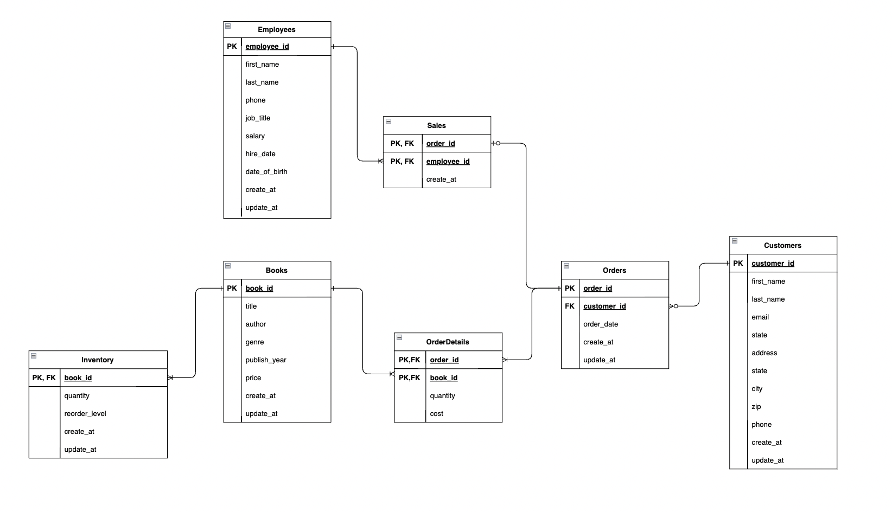

# Go Bookstore

This is a sample application that demonstrates how to build a Go application using the Clean Architecture.

## Table of Contents

- [Getting Started](#getting-started)
  - [Installing](#installing)
  - [ER Diagram](#er-diagram)
  - [Router](#installing)
    - [User Router](#user-router)
    - [Book Router](#book-router)

## Getting Started

<!-- ### Prerequisites -->

### ER Diagram

  

### Installing

```
git clone https://github.com/nutthanonn/go-bookstore.git
cd go-bookstore
go get
```

# Router

## User Router

|    API Path    | Method |       What it does        |
| :------------: | :----: | :-----------------------: |
|   /api/users   |  GET   | Fetches the list of users |
|   /api/users   |  POST  |        Create user        |
| /api/users/:id | DELETE |        Delete user        |

## Book Router

|    API Path    | Method |       What it does        |
| :------------: | :----: | :-----------------------: |
|   /api/books   |  GET   | Fetches the list of books |
| /api/books/:id |  GET   |     Fetch book by id      |
|   /api/books   |  POST  |        Create book        |
| /api/books/:id |  PUT   |        Update book        |
| /api/books/:id | DELETE |        Delete book        |
