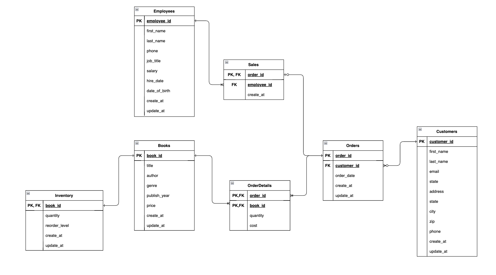

# Go Bookstore

This is a sample application that demonstrates how to build a Go application using the Clean Architecture.

## Table of Contents

- [Getting Started](#getting-started)

  - [Installing](#installing)
  - [Setup](#Setup)
  - [Run Server](#run-server)
  - [Unit Testing](#unit-testing)
  - [ER Diagram](#er-diagram)
  - [API Documentation](#api-documentation)
    - [Book Router](#book-router)
    - [Employee Router](#employee-router)
    - [Customer Router](#customer-router)
    - [Order Router](#order-router)
    - [Inventory Router](#inventory-router)

## Getting Started

### ER Diagram

  

### Installing

```bash
git clone https://github.com/nutthanonn/go-bookstore.git
cd go-bookstore
go get
```

### Setup

_Create .env file in root project_

```.env
DB_USERNAME=
DB_PASSWORD=
DB_HOST=
DB_PORT=
DB_NAME=
DB_TEST_NAME=
COOKIE_SECRET_KEY=
TOKEN_SECRET_KEY=
```

### Run Server

```bash
chmod +x start_server.sh
./start_server.sh
```

### Unit Testing

```bash
cd test
cd directory_for_testing
go test -v
```

# Router

## Book Router

|    API Path    | Method |       What it does        |
| :------------: | :----: | :-----------------------: |
|   /api/books   |  GET   | Fetches the list of books |
| /api/books/:id |  GET   |     Fetch book by id      |
|   /api/books   |  POST  |        Create book        |
| /api/books/:id |  PUT   |        Update book        |
| /api/books/:id | DELETE |        Delete book        |

## Employee Router

|     API Path      | Method |         What it does          |
| :---------------: | :----: | :---------------------------: |
|   /api/employee   |  GET   | Fetches the list of employees |
| /api/employee/:id |  GET   |     Fetch employee by id      |
|   /api/employee   |  POST  |        Create employee        |
| /api/employee/:id |  PUT   |        Update employee        |
| /api/employee/:id | DELETE |        Delete employee        |

## Customer Router

|     API Path      | Method |         What it does          |
| :---------------: | :----: | :---------------------------: |
|   /api/customer   |  GET   | Fetches the list of customers |
| /api/customer/:id |  GET   |     Fetch customer by id      |
|   /api/customer   |  POST  |        Create customer        |
| /api/customer/:id |  PUT   |        Update customer        |
| /api/customer/:id | DELETE |        Delete customer        |

## Order Router

|    API Path    | Method |      What it does       |
| :------------: | :----: | :---------------------: |
| /api/order/:id |  GET   | Fetch order by order_id |
|   /api/order   |  POST  |      Create order       |
| /api/order/:id | DELETE |      Delete order       |

## Inventory Router

|     API Path      | Method |        What it does        |
| :---------------: | :----: | :------------------------: |
| /api/employee/:id |  GET   | Fetch inventory by book_id |
| /api/employee/:id |  PUT   |      Update inventory      |
