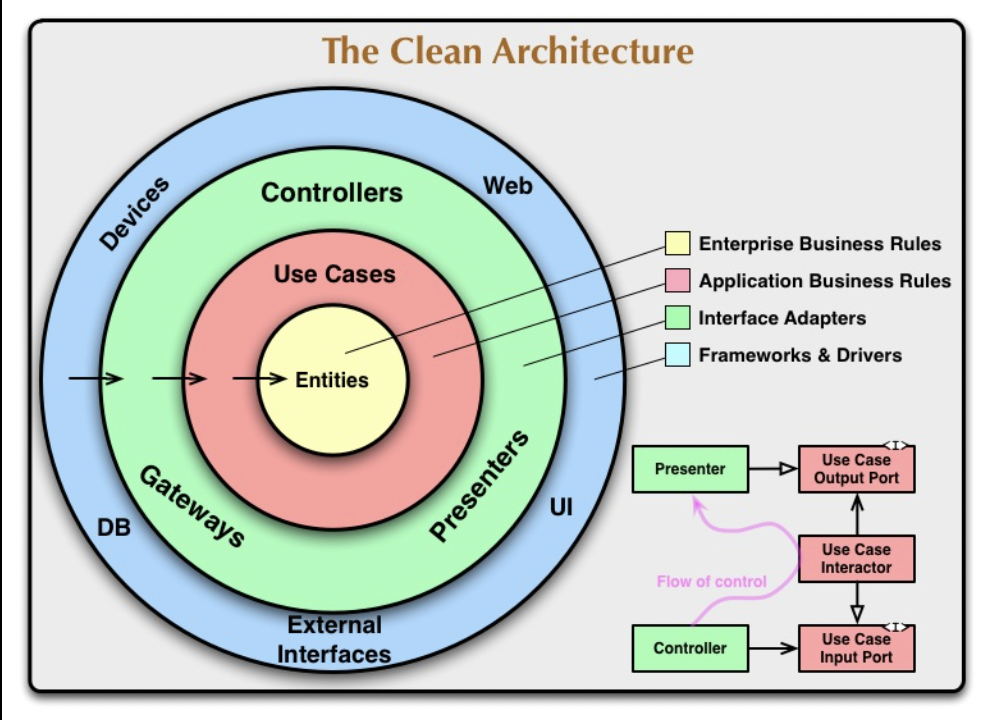

# Golang chean architecture

## Overview

This is a sample application for Golang clean architecture.



## Installation

```bash
git clone https://github.com/nutthanonn/golang-clean-architecture.git
cd golang-clean-architecture
go get
```

## How to run

```bash
cd api
npx go-mon app.go
```

## Routes

|    API Path    | Method |       What it does        |
| :------------: | :----: | :-----------------------: |
|   /api/users   |  GET   | Fetches the list of users |
|   /api/users   |  POST  |        Create user        |
| /api/users/:id | DELETE |        Delete user        |
